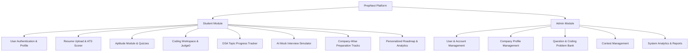

# 🚀 PrepNest — A Smart Placement Preparation Platform

<div align="center">

[](https://react.dev/)
[](https://tailwindcss.com/)
[](https://fastapi.tiangolo.com/)
[](https://python.org)
[](https://postgresql.org)
[](https://redis.io)
[](https://jwt.io)
[](https://judge0.com)

<p align="center">
  <strong>An AI-powered web-based placement preparation platform enabling students to master DSA, practice aptitude tests, analyze resumes against ATS algorithms, ace AI mock interviews, and access company-specific recruitment tracks in a unified ecosystem.</strong>
</p>

[Project Details](#-project-details) • [Introduction & Scope](#-introduction--scope) • [Product Modules](#-product-modules) • [Functional Requirements](#-functional-requirements) • [Tech Stack](#-tech-stack-and-system-environment) • [Project Structure](#-project-structure) • [Getting Started](#-getting-started) • [API Documentation](#-api-documentation) • [Application Routes](#-application-routes) • [Future Scope](#-future-scope)

</div>

---

## 📋 Project Details

  
> **Course / Department:** Computer Science and Engineering  

> **Supervisor:** Dr. Sibo Prasad Patro  


### 👥 Team Members
| Roll No | Registration No | Student Name | Role |
| :--- | :--- | :--- | :--- |
| **24CSE003** | `24UG010070` | **Sameer Ranjan Nayak** | Full stack developer |
| **24CSE024** | `24UG010091` | **D Ritwika** | Backend and system architect|
| **24CSE034** | `24UG010101` | **Gudla Vivek** | frontend & AI Integration|

---

## 📖 Introduction & Scope

### 🎯 Purpose
The purpose of **PrepNest** is to develop an intelligent web-based placement preparation platform that enables students to prepare for campus recruitment through a single integrated system. The platform provides:
- Aptitude tests and assessments
- Coding challenges with real-time evaluation
- Resume ATS analysis and optimization
- AI-powered technical and HR mock interviews
- Company-specific preparation tracks and resources
- Personalized learning roadmaps and skill gap identification

It simplifies the placement preparation workflow while sharpening students' technical, analytical, and communication skills.

### 🌐 Scope
PrepNest provides a centralized environment for campus recruitment readiness:
- **Comprehensive Preparation**: Unifies aptitude quizzes, coding practice, resume evaluation, AI mock interviews, and curated company question banks.
- **AI-Powered Diagnostics**: Identifies individual skill gaps, delivers tailored preparation roadmaps, and monitors progress through interactive analytical dashboards.
- **Administrative Control**: Provides an admin portal for managing users, questions, coding contests, and tracking institutional analytics.
- **Future Scope**: Planned extensions for recruiter portal access, AI-driven placement probability prediction, and advanced RAG-based career mentoring.

---

## 📚 Definitions, Acronyms & Abbreviations

| Abbreviation | Description |
| :--- | :--- |
| **AI** | Artificial Intelligence |
| **ML** | Machine Learning |
| **LLM** | Large Language Model (e.g., OpenAI GPT, Google Gemini) |
| **ATS** | Applicant Tracking System |
| **OCR** | Optical Character Recognition |
| **NLP** | Natural Language Processing |
| **RAG** | Retrieval-Augmented Generation |
| **SQL / DBMS** | Structured Query Language / Database Management System |
| **UI / UX** | User Interface / User Experience |
| **API** | Application Programming Interface |
| **JWT** | JSON Web Token (Stateless Authentication) |

---

## 🧩 Product Modules & Functions



### 🎓 1. Student Module
* **User Authentication & Profile**: Secure sign-up/login, personal and academic profile configuration, skill tags, and credit tracking.
* **Resume Upload & ATS Analysis**: Support for PDF and DOCX uploads, OCR/NLP text extraction, 0–100% ATS score computation, keyword match percentage, and actionable suggestions.
* **Aptitude Practice**: Topic-wise aptitude assessments (Quantitative, Logical, Verbal), timed quizzes, instant scoring, and explanation reviews.
* **Coding Workspace & Evaluation**: In-browser code editor integrated with Judge0 execution engine supporting multiple languages (Python, Java, C++, JavaScript).
* **DSA Progress Tracker**: Curated sheets (Arrays, Trees, Graphs, DP, Two Pointers), bookmarking, difficulty filtering (`Easy`, `Medium`, `Hard`), and topic completion tracking.
* **AI Mock Interviews (HR & Technical)**: Simulated video room with webcam and microphone integration, audio/text interaction, and real-time structured evaluation on algorithmic accuracy, communication, and confidence.
* **Company-Specific Tracks**: Targeted question archives and interview preparation resources for Google, Microsoft, Amazon, Meta, Adobe, and more.
* **Personalized Roadmap & Skill Gap Analysis**: AI-generated remediation roadmaps based on quiz performance and problem-solving history.
* **Interactive Dashboard & Leaderboards**: Dynamic placement readiness score, daily streak tracking, XP points, weekly efficiency charts, and peer leaderboards.

### 🛡️ 2. Admin Module
* **User Management**: Monitor registered students, verify profiles, adjust access levels, and audit student engagement.
* **Company Management**: Add, update, and manage company hiring profiles, recruitment criteria, and question archives.
* **Problem & Question Management**: Upload and curate aptitude questions, coding problems, test cases, and difficulty metadata.
* **Contest Management**: Schedule and host campus placement mock tests and competitive coding contests.
* **System Analytics & Reporting**: View aggregate platform metrics, student readiness distributions, and export comprehensive performance reports.

---

## 🎯 Functional Requirements (SRS Specification)

| Req ID | Module | Functional Specification |
| :--- | :--- | :--- |
| **FR-1** | **User Authentication** | The system shall allow users to register, log in, and securely access their accounts using salted password hashing and stateless JWT bearer tokens. |
| **FR-2** | **Profile Management** | The system shall allow users to create and update their personal, academic, skill details, target companies, and track credit balance. |
| **FR-3** | **Resume Analyzer** | The system shall accept PDF/DOCX resumes, analyze keyword density against software engineering standards, compute ATS compatibility scores, and deliver improvement tips. |
| **FR-4** | **Aptitude Module** | The system shall provide topic-wise aptitude quizzes, evaluate responses in real time, and record detailed performance scores. |
| **FR-5** | **Coding Module** | The system shall provide coding challenges with an integrated online code editor, test case runner, and instant code evaluation via Judge0 API. |
| **FR-6** | **DSA Progress Tracker** | The system shall track users' topic-wise progress across Data Structures and Algorithms with completion metrics and company tags. |
| **FR-7** | **Mock Interview** | The system shall conduct AI-based HR and technical mock interviews using webcam and microphone inputs, generating structured feedback on content and communication. |
| **FR-8** | **Company Preparation** | The system shall provide company-wise interview questions, hiring patterns, past test trends, and preparation resources. |
| **FR-9** | **Dashboard & Leaderboard** | The system shall display overall readiness scores, activity heatmaps, progress analytics, and campus-wide rankings. |
| **FR-10** | **Admin Panel** | The system shall allow administrators to manage users, questions, contests, company archives, and export institutional placement analytics. |

---

## 👥 User Classes & Characteristics

* **Student / Candidate**:
  - Registers and maintains academic profile
  - Solves coding challenges and attempts aptitude assessments
  - Uploads resumes for automated ATS analysis
  - Attends AI technical & HR mock interviews
  - Tracks individual placement readiness metrics and follows customized roadmaps
* **Administrator**:
  - Manages student records and role privileges
  - Uploads questions, test cases, and company interview archives
  - Configures and oversees coding contests
  - Monitors system analytics and generates performance reports

---

## 🛠️ Tech Stack and System Environment

### 💻 Software Stack
```
Frontend:       React 19, Vite, Tailwind CSS, Lucide React, Recharts, Framer Motion, TypeScript / JavaScript
Backend:        FastAPI (Python 3.9+), Uvicorn ASGI Server, Pydantic v2
Database & Cache: PostgreSQL / SQLite3, Redis (Session caching & rate-limiting)
AI & NLP:       OpenAI GPT API / Google Gemini API, LangChain, Sentence Transformers
Code Execution: Judge0 API (Multi-language compilation & test runner)
Authentication: JWT (JSON Web Tokens), OAuth 2.0, Passlib & Bcrypt Hashing
Dev & DevOps:   Docker, Postman, Visual Studio Code, Git, GitHub
```

### ⚙️ Hardware Specifications
| Specification | Minimum Requirement | Recommended Requirement |
| :--- | :--- | :--- |
| **Processor** | Intel Core i3 (or equivalent) | Intel Core i5 / AMD Ryzen 5 or above |
| **RAM** | 4 GB | 8 GB / 16 GB |
| **Free Storage** | 2 GB free space | 10 GB free space |
| **Peripherals** | Standard Keyboard & Mouse | HD Webcam & Noise-Cancelling Microphone (for Mock Interviews) |
| **Network** | Stable Broadband Connection | High-Speed Internet (5+ Mbps for real-time video/AI APIs) |

### 🌐 Operating & Browser Compatibility
* **Operating Systems**: Windows 10/11, macOS, Linux
* **Web Browsers**: Google Chrome, Mozilla Firefox, Microsoft Edge, Safari

### 🔒 Design & Implementation Constraints
1. **Security & Authentication**: Strict JWT bearer token authentication and salted password hashing.
2. **AI API Dependency**: Continuous service requires active API access (OpenAI / Gemini).
3. **File Format Restrictions**: Resume uploads strictly restricted to `.pdf` and `.docx` formats.
4. **Data Privacy**: Complete user confidentiality and secure storage of resumes and performance records.

---

## 📁 Project Structure

```text
PrepNest-main/
├── backend/
│   ├── auth.py              # JWT token generation, verification & bcrypt password hashing
│   ├── database.py          # SQLite / PostgreSQL database connection & table schema
│   ├── main.py              # FastAPI endpoints, CORS middleware & route handlers
│   └── requirements.txt     # Python backend dependencies
│
└── frontend/
    ├── public/              # Static public assets & favicons
    ├── src/
    │   ├── assets/          # Project branding, logos and illustration assets
    │   ├── components/      # Reusable UI component library
    │   │   ├── Header.jsx   # Top navigation bar with notifications, credits & user profile
    │   │   └── Sidebar.jsx  # Responsive collapsible sidebar navigation
    │   ├── lib/
    │   │   └── mockData.js  # Curated datasets (DSA problems, Companies, Resumes, User stats)
    │   ├── pages/           # Application route views
    │   │   ├── AIAssistant.jsx    # Context-aware AI placement mentor chat interface
    │   │   ├── CompanyPrep.jsx    # Company-specific preparation tracks (Google, Amazon, etc.)
    │   │   ├── Dashboard.jsx      # Student dashboard, placement readiness score & analytics
    │   │   ├── DSA.jsx            # DSA questions directory with difficulty & topic filters
    │   │   ├── Landing.jsx        # Public landing page with features, statistics & pricing
    │   │   ├── Login.jsx          # User login portal connected to FastAPI backend
    │   │   ├── MockInterview.jsx  # AI mock interview simulation room with webcam & timer
    │   │   ├── ResumeAnalyzer.jsx # ATS resume parser, keyword matching & improvement engine
    │   │   └── Signup.jsx         # User registration portal with automatic credit allocation
    │   ├── App.jsx          # Client-side router configuration & navigation flow
    │   ├── globals.css      # Custom Tailwind styles, scrollbars & glow effects
    │   └── main.jsx         # React DOM entry point
    ├── index.html           # HTML5 entry template
    ├── package.json         # Frontend npm dependencies and build scripts
    ├── postcss.config.js    # PostCSS configuration
    ├── tailwind.config.js   # Custom dark-theme colors, glows & typography
    └── vite.config.js       # Vite build setup with path aliases (`@/`)
```

---

## 🚀 Getting Started

Follow these step-by-step instructions to set up and run the application locally on your machine.

### 📋 Prerequisites
Ensure you have the following installed:
* **Node.js**: `v18.0.0` or higher ([Download Node.js](https://nodejs.org/))
* **npm** (comes with Node.js) or **pnpm** / **yarn**
* **Python**: `3.9` or higher ([Download Python](https://www.python.org/))
* **Git**

---

### 1️⃣ Clone or Navigate to the Project

```bash
git clone https://github.com/sameerranjan10/PrepNest.git
cd PrepNest-main
```

---

### 2️⃣ Backend Setup (FastAPI)

1. Open a terminal and navigate to the backend directory:
   ```bash
   cd backend
   ```

2. Create and activate a Python virtual environment:
   * **Windows (PowerShell):**
     ```powershell
     python -m venv venv
     .\venv\Scripts\Activate.ps1
     ```
   * **macOS / Linux:**
     ```bash
     python3 -m venv venv
     source venv/bin/activate
     ```

3. Install backend dependencies:
   ```bash
   pip install -r requirements.txt
   ```

4. Start the FastAPI backend server:
   ```bash
   uvicorn main:app --reload --host 0.0.0.0 --port 8000
   ```

   * Backend API Live: **`http://localhost:8000`**  
   * Interactive Swagger Documentation: **`http://localhost:8000/docs`**  
   * ReDoc Documentation: **`http://localhost:8000/redoc`**

---

### 3️⃣ Frontend Setup (React + Vite)

1. Open a new terminal window and navigate to the frontend directory:
   ```bash
   cd frontend
   ```

2. Install frontend dependencies:
   ```bash
   npm install
   ```

3. Start the Vite development server:
   ```bash
   npm run dev
   ```

4. Open your browser and navigate to:
   ```text
   http://localhost:5173
   ```

---

## 🔌 API Documentation

The FastAPI backend exposes RESTful endpoints with JSON payload exchanges:

### Core Endpoints

| Method | Endpoint | Description | Auth Required |
| :--- | :--- | :--- | :--- |
| `GET` | `/api/health` | Backend service health check | No |
| `POST` | `/api/auth/register` | Register a new student account & issue JWT token | No |
| `POST` | `/api/auth/login` | Authenticate credentials and return JWT bearer token | No |
| `GET` | `/api/auth/me` | Retrieve authenticated profile, stats & credits | Yes (`Bearer <token>`) |

#### Sample Registration Request:
```json
POST /api/auth/register
Content-Type: application/json

{
  "full_name": "Sameer Ranjan Nayak",
  "email": "sameer@prepnest.ai",
  "password": "SecurePassword123!"
}
```

#### Sample Authentication Response:
```json
{
  "access_token": "eyJhbGciOiJIUzI1NiIsInR5cCI6IkpXVCJ9...",
  "token_type": "bearer",
  "user": {
    "id": 1,
    "email": "sameer@prepnest.ai",
    "full_name": "Sameer Ranjan Nayak",
    "plan": "Pro",
    "credits": 250,
    "created_at": "2026-08-31 16:00:00"
  }
}
```

---

## 🗺️ Application Routes

| Route | Page | Module Description |
| :--- | :--- | :--- |
| `/landing` | **Landing Page** | Showcase hero, features, statistics, pricing tiers, and FAQs |
| `/login` | **Login Portal** | Secure JWT-based user authentication |
| `/signup` | **Sign Up Portal** | New user onboarding with initial credits |
| `/dashboard` | **Dashboard** | Placement readiness score, streak tracker, analytics charts & recent activity |
| `/dsa` | **DSA Directory** | Curated topic sheets, company frequency tags, and progress tracking |
| `/mock-interview` | **Mock Interview** | Real-time AI technical & HR mock interview simulation room |
| `/resume-analyzer` | **Resume Analyzer** | ATS scoring, keyword match breakdown & actionable formatting suggestions |
| `/company-prep` | **Company Track** | Targeted tracks for Google, Amazon, Meta, Microsoft, Adobe, etc. |
| `/ai-assistant` | **AI Placement Mentor** | Context-aware AI assistant for algorithmic doubts & system design review |

---

## 🔮 Future Scope & Roadmap

- [ ] **Recruiter Portal & Campus Dashboard**: Dedicated interface for corporate recruiters to post drives and view verified student readiness scores.
- [ ] **AI Placement Prediction**: Machine learning model to forecast student placement probability based on test history and coding milestones.
- [ ] **Real-Time Speech-to-Text & Video Analysis**: Whisper API integration for real-time speech evaluation, filler word detection, and facial confidence analysis.
- [ ] **Live Monaco Code Editor with Judge0 Integration**: In-browser multi-language compilation with automated test suite verification.
- [ ] **Automated PDF/DOCX Resume Parser**: Dynamic OCR and NLP extraction for custom candidate resume uploads.
- [ ] **Campus-Wide Competitive Contests**: Real-time multiplayer coding contests with live leaderboards using WebSockets.

---

## 📄 License & Attribution

This project is developed under **Minor Project - I** for academic placement preparation purposes.  
Licensed under the [MIT License](LICENSE) — feel free to contribute, customize, and build upon it!
