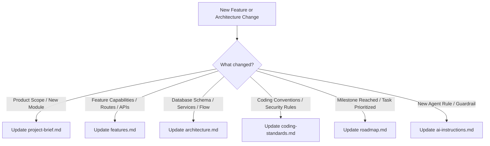

# 📚 PrepNest Project Documentation & Context System

Welcome to the **PrepNest Documentation & Architecture Hub**. This directory provides the single source of truth for PrepNest's system architecture, engineering standards, product vision, and operational rules.

---

## 🎯 Purpose of This Context System

This documentation system is designed to:
1. **Eliminate AI Hallucinations:** Provide immediate ground-truth context to any AI coding assistant or engineer working across the full-stack repository.
2. **Preserve Long-Term Architectural Integrity:** Ensure consistency across UI components, database mutations, authentication paradigms, and asynchronous pipelines.
3. **Track Project Evolution:** Document current sprint priorities, technical debts, milestones, and strategic backlogs.

---

## 📑 Core Documentation Index

| Document | Primary Focus | Target Audience | Update Frequency |
| :--- | :--- | :--- | :--- |
| **[`project-brief.md`](./project-brief.md)** | Product vision, problem statements, target personas, functional modules, and project KPIs. | Product Leads, Faculty Supervisors, Contributors | Major project milestones |
| **[`architecture.md`](./architecture.md)** | System topology, tech stack breakdown, database ER diagrams, API pipelines, and design patterns. | System Architects, Full-Stack Engineers, AI Agents | Schema or service modifications |
| **[`coding-standards.md`](./coding-standards.md)** | Python/FastAPI conventions, React/Tailwind guidelines, cursor safety, error handling, and security rules. | All Developers, Code Reviewers, AI Agents | As team standards evolve |
| **[`roadmap.md`](./roadmap.md)** | Phased rollout plans, completed milestones, active sprint tasks, and prioritized feature backlog. | Project Managers, Developers | Per development sprint |
| **[`features.md`](./features.md)** | Comprehensive feature matrix, capabilities, frontend routes, and API endpoints. | Product Leads, QA, Developers, AI Agents | As features are added or enhanced |
| **[`ai-instructions.md`](./ai-instructions.md)** | System prompt and guardrails for autonomous AI agents (invariants, what files to read first, edge-case protocols). | AI Coding Assistants, Pair Programmers | When workflow rules change |

---

## 🔄 Document Maintenance Lifecycle

### Quick Instructions for Contributors:
- **Never let documentation go stale:** When modifying a database table in `backend/database.py` or introducing a new page in `frontend/src/pages/`, spend 2 minutes updating the corresponding sections in `architecture.md` and `roadmap.md`.
- **Reference documentation in PRs and Prompts:** Point AI assistants directly to `docs/ai-instructions.md` and `docs/architecture.md` when initiating new coding tasks.
