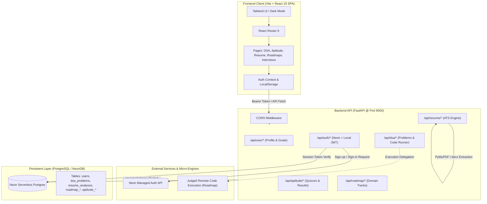
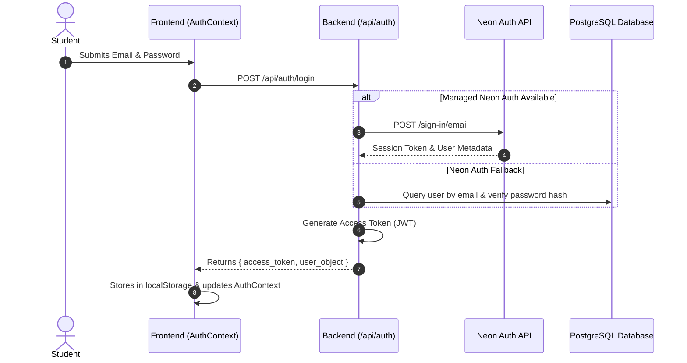
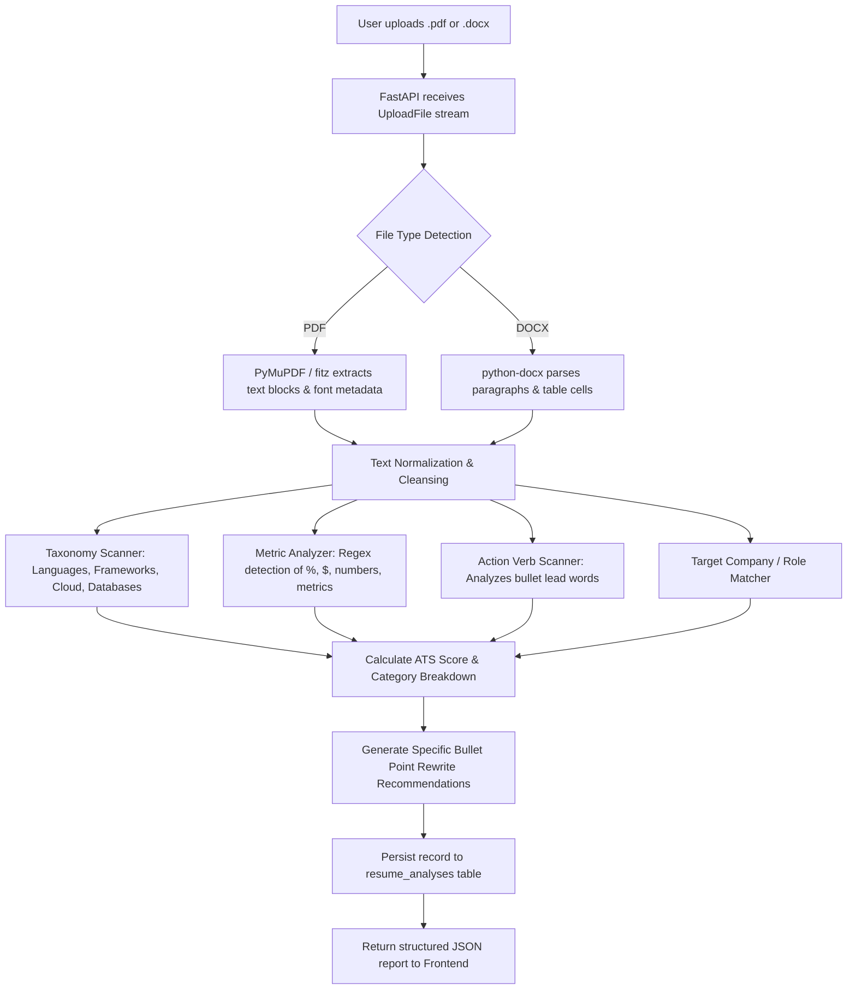
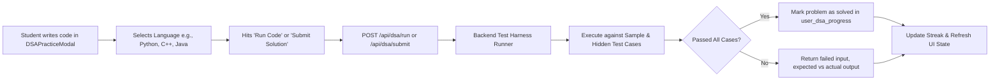
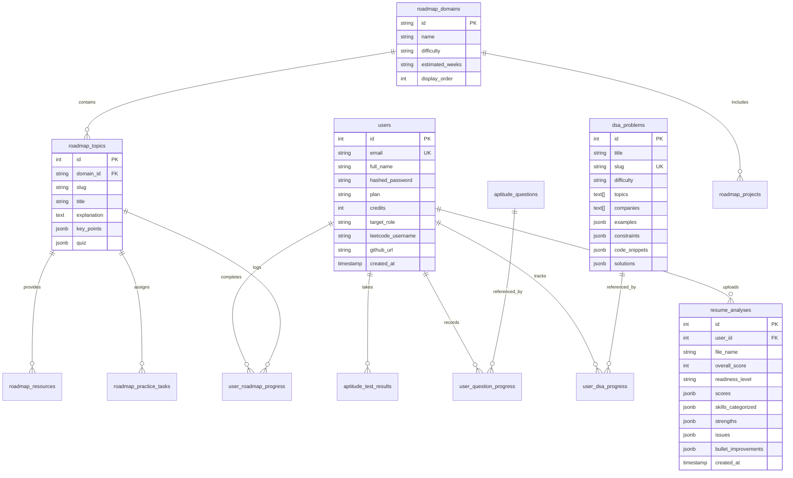

<!-- 
  PREPNEST CONTEXT SYSTEM | DOCUMENT 2 OF 5
  HOW TO UPDATE:
  - Update this document whenever new services, database tables, external APIs,
    or fundamental architecture flows are introduced or modified.
  - Review prior to any significant refactoring or dependency additions.
-->

# 🏛️ PrepNest — System Architecture & Technical Specifications

| Spec | Details |
| :--- | :--- |
| **System Classification** | Modular Client-Server Web Application |
| **Backend Runtime** | Python 3.9+ with FastAPI (Asynchronous ASGI) |
| **Frontend Framework** | React 19 + Vite 8 (SPA Architecture) |
| **Styling Engine** | Tailwind CSS 3.4 (Dark-Themed Slate Palette) |
| **Database Engine** | PostgreSQL (Neon Serverless PostgreSQL with SSL connection pooling) |
| **Document Parsers** | PyMuPDF (fitz), python-docx |
| **Primary State Management** | React Context (`AuthContext`), React Hook State, TanStack React Query 5 |

---

## 1. System Topology & Architectural Diagram



---

## 2. Technology Stack Breakdown

### Frontend Layer
- **Core:** React 19.x with functional components and React Hooks.
- **Build Tool:** Vite 8.x featuring Fast Refresh and ESM bundling.
- **Styling:** Tailwind CSS 3.4 with custom utility combinations, CSS variables, and Lucide React icons.
- **Routing:** `react-router-dom` v6 with declarative routing and role/session-based `ProtectedRoute` guards.
- **Data Fetching & State:**
  - `AuthContext`: Centralized authentication status, user profile syncing, token persistence.
  - `@tanstack/react-query`: Efficient caching, refetching, and server-state synchronization.
  - `recharts`: Performance visualization across aptitude test results and DSA progress.
  - `framer-motion`: Smooth transitions across modals, drawers, and quiz step-cards.

### Backend Layer
- **Web Framework:** FastAPI with asynchronous endpoint support and Pydantic v2 data serialization.
- **Server:** Uvicorn ASGI server with automatic reload during development.
- **Security & Tokens:**
  - `PyJWT`: HMAC-SHA256 stateless access tokens.
  - `hashlib` & `bcrypt`: Multi-layer password hashing with application-level salting.
  - CORS middleware configured for cross-origin local and production origin headers.
- **Document Processing:**
  - `pymupdf` (Fitz): High-speed PDF text and layout extraction for resume analysis.
  - `python-docx`: Microsoft Word (.docx) document structure parser.

### Database Layer
- **Engine:** PostgreSQL 16 on Neon Serverless Cloud.
- **Connection Driver:** `psycopg2-binary` with `RealDictCursor` for dictionary-mapped SQL output.
- **Connection Management:** Dynamic pool management via environment variable `DATABASE_URL` with SSL mode enabled.
- **Schema Management:** Automated startup verification and dynamic column migration (`ALTER TABLE ADD COLUMN IF NOT EXISTS`) implemented in `backend/database.py`.

---

## 3. Directory Structure

```plaintext
PrepNest-main/
├── README.md                      # High-level overview & quickstart guide
├── start.bat                      # Windows launcher for concurrent frontend + backend
├── docs/                          # Architectural & AI context documentation
│   ├── README.md                  # Documentation map & usage guide
│   ├── project-brief.md           # Product requirements & problem statement
│   ├── architecture.md            # Technical specifications & topology
│   ├── coding-standards.md        # Style guides, conventions & error handling
│   ├── roadmap.md                 # Implementation phases & task backlogs
│   └── ai-instructions.md         # Autonomous AI developer rules & context
│
├── backend/                       # FastAPI application & business logic
│   ├── main.py                    # Root FastAPI app, routing, controllers (~2700 lines)
│   ├── auth.py                    # Auth utilities, Neon Auth proxy, JWT lifecycle
│   ├── database.py                # Postgres connection factory, schemas & seeds
│   ├── resume_service.py          # ATS scoring logic, taxonomy, keyword extractors
│   ├── requirements.txt           # Python dependency declarations
│   ├── .env                       # Environment configs (DATABASE_URL, NEON_AUTH_URL)
│   ├── data/                      # Static datasets & taxonomy
│   │   ├── company_role_requirements.json # Job matching keyword corpora
│   │   ├── sample_questions.csv   # Seed question bank
│   │   └── sample_questions.json  # JSON format questions
│   ├── ingest_dsa.py              # DSA problem ingestion pipeline
│   ├── seed_roadmap.py            # Pre-populates 7 roadmap domains & 35 topics
│   └── test_roadmap_suite.py      # Automated validation suite for roadmap APIs
│
└── frontend/                      # React 19 + Vite single-page application
    ├── index.html                 # Single page root HTML
    ├── vite.config.js             # Vite configuration with @ path aliases
    ├── tailwind.config.js         # Tailwind theme & plugin configurations
    ├── package.json               # Node.js dependencies & scripts
    └── src/
        ├── main.jsx               # React DOM entry point
        ├── App.jsx                # Router configuration & protected layout
        ├── globals.css            # Base stylesheet & scrollbar modifications
        ├── context/
        │   └── AuthContext.jsx    # User session, login/logout, profile state
        ├── components/
        │   ├── Header.jsx         # Global top navigation & search bar
        │   ├── Sidebar.jsx        # Primary platform navigation bar
        │   ├── ProtectedRoute.jsx # Route-guard checking authentication token
        │   ├── DSAPracticeModal.jsx # LeetCode-style code solving workspace
        │   └── QuestionDirectory.jsx # Searchable aptitude question browser
        ├── pages/
        │   ├── Landing.jsx        # Public hero landing page
        │   ├── Login.jsx / Signup.jsx # Auth pages
        │   ├── Dashboard.jsx      # Metrics overview, streaks & recent attempts
        │   ├── DSA.jsx            # DSA repository with company & difficulty filters
        │   ├── Aptitude.jsx       # Quizzes, timed evaluations & scorecards
        │   ├── ResumeAnalyzer.jsx # ATS analysis, keyword matching & bullet enhancer
        │   ├── Roadmaps.jsx       # 7 curated domain tracks with mini-projects
        │   ├── CompanyPrep.jsx    # Company syllabus & round breakdowns
        │   ├── MockInterview.jsx  # AI interview simulator with camera/mic
        │   ├── AIAssistant.jsx    # Placement mentor conversational UI
        │   ├── Leaderboard.jsx    # Student ranking and streak leaderboard
        │   ├── Community.jsx      # Discussion threads & peer Q&A
        │   └── Settings.jsx       # Profile editing, coding handles & password update
        └── lib/
            ├── aptitudeData.js    # Aptitude fallback data structures
            └── mockData.js        # Default user metrics & mock state
```

---

## 4. Key Data Flow Pipelines

### 4.1 Authentication Flow (Hybrid Model)


### 4.2 Resume ATS Analysis Pipeline


### 4.3 Interactive Code Execution Pipeline


---

## 5. Relational Database Schema Design

The platform relies on normalized PostgreSQL tables with foreign key cascades:



---

## 6. Architectural Design Patterns Applied

1. **Layered Separation of Concerns:**
   - Transport layer (FastAPI route declarations, status codes, query parameters).
   - Domain logic layer (`resume_service.py`, `auth.py`).
   - Persistence layer (`database.py` with explicit transaction commits and cursors).

2. **Defensive Schema Evolution:**
   - Startup hooks automatically invoke `ALTER TABLE ADD COLUMN IF NOT EXISTS` for all incrementally added user fields and problem metadata, preventing breaking deployments when schemas expand.

3. **Hybrid Authentication with Graceful Fallback:**
   - When configured, queries authenticate against managed cloud Neon Auth sessions.
   - If Neon Auth is unavailable, the system safely falls back to local JWT token generation and salted SHA-256 password hash comparison, preventing developer lockouts during local offline work.

4. **Normalized Taxonomy & JSONB Flexibility:**
   - Uses relational foreign keys for user ownership and problem tracking, combined with PostgreSQL `JSONB` columns for unstructured metadata (test cases, code snippets, keyword breakdowns, bullet improvements).
