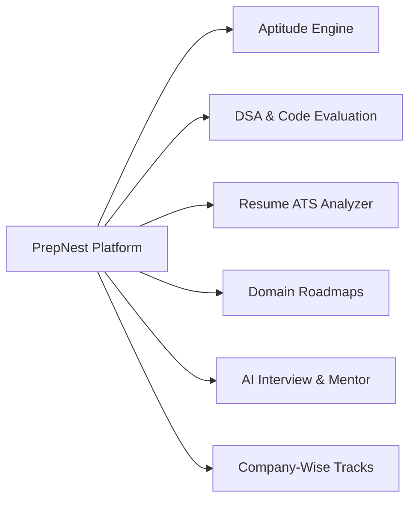

<!-- 
  PREPNEST CONTEXT SYSTEM | DOCUMENT 1 OF 5
  HOW TO UPDATE:
  - Update this document when high-level project goals, target audience, core problem statements,
    or key product boundaries change.
  - Review at the beginning of each major academic milestone or release cycle.
-->

# 📋 PrepNest — Project Brief & Product Vision

| Metadata | Value |
| :--- | :--- |
| **Project Name** | **PrepNest** (Smart Placement Preparation Platform) |
| **Status** | Active Development (MVP Phase / Pre-Release) |
| **Department / Institution** | Computer Science & Engineering |
| **Project Supervisor** | Dr. Sibo Prasad Patro |
| **Core Architecture & Lead** | D Ritwika (Backend & System Architecture), Sameer Ranjan Nayak (Full Stack), Gudla Vivek (Frontend & AI) |
| **Last Updated** | October 2026 |

---

## 1. Executive Summary

**PrepNest** is an intelligent, unified web-based placement preparation platform engineered to bridge the critical gap between university academic curricula and corporate technical recruitment standards. 

Traditionally, undergraduate computer science students navigate fragmented tools: LeetCode for DSA, IndiaBIX for aptitude, separate ATS checkers for resume formatting, random YouTube videos for system design, and ad-hoc peer groups for mock interviews. PrepNest integrates these dispersed stages into a cohesive, data-driven preparation operating system.

---

## 2. Problem Statement

Campus recruitment drives impose high-stakes, multi-stage filtration funnels:
1. **Aptitude Screenings:** Strict time limits covering Quantitative, Logical, and Verbal reasoning with negative marking.
2. **Coding Filtration:** DSA assessments requiring clean time/space complexity under automated test harness evaluation.
3. **Automated ATS Gatekeeping:** Over 75% of student resumes are eliminated by Applicant Tracking Systems due to poor formatting, lack of action verbs, unquantified metrics, or missing domain keywords.
4. **Interview Anxiety & Articulation Gaps:** Students often fail technical and behavioral interviews due to a lack of structured feedback on communication, body language, and problem decomposition.
5. **Lack of Personalization:** Students lack actionable diagnostics revealing exact conceptual weak points across topics and target corporate profiles.

---

## 3. Product Vision & Value Proposition

PrepNest delivers a single dashboard experience that:
- **Diagnoses Weaknesses Early:** Evaluates real-time diagnostic performance in DSA, Aptitude, and Resume readiness.
- **Provides Company-Centric Alignment:** Curates questions and patterns tailored to specific tech firms (e.g., Google, Amazon, TCS, Infosys, Microsoft, Cognizant, Wipro).
- **Automates Feedback Loops:** Employs rule-based heuristics and generative AI diagnostics for resume analysis, instant code testing, and mock interviews.
- **Maintains Motivation & Accountability:** Features domain-specific learning roadmaps, interactive milestones, community interaction, and leaderboard gamification.

---

## 4. Target Audience & User Personas

| Persona | Description | Primary Needs & Pain Points |
| :--- | :--- | :--- |
| **Pre-Final / Final Year Engineering Students** | Primary users actively preparing for on-campus & off-campus drives. | Needs structured DSA tracks, company-specific question archives, and ATS resume scoring. |
| **Self-Paced Novices (1st - 2nd Year)** | Early-stage students looking for foundational CS roadmaps. | Needs structured topic progressions (e.g., C++, Java, Web Dev, Core CS). |
| **Training & Placement Cell (T&P Admins)** | University administrators and faculty coordinators. | Needs visibility into aggregate cohort readiness, contest organization, and analytics. |
| **Peer Mentors & Campus Communities** | Student community leads and alumni. | Needs community discussion forums, peer-review channels, and shared resources. |

---

## 5. Core Product Pillars & Functional Modules

### Module Breakdown:
1. **Authentication & Profile Management:**
   - Multi-tier auth supporting managed Neon Auth and local JWT tokens.
   - Deep student profiles tracking academic metrics (CGPA, 10th/12th %), target companies, LeetCode/GitHub handles, and daily practice streaks.
2. **Aptitude Practice & Diagnostic Testing:**
   - Comprehensive question bank (Quantitative, Logical, Verbal, Core CS).
   - Timed quiz assessments, instant answer validation, category-level scorecards, and historical performance tracking.
3. **DSA Problem Suite & Code Workspace:**
   - LeetCode-style problem repository with difficulty filters, company tags, and acceptance metrics.
   - Built-in code editor supporting run/submit actions with sample and hidden test case verification.
4. **Automated Resume & ATS Analyzer:**
   - Multi-format file parsing (`.pdf` via PyMuPDF, `.docx` via python-docx).
   - Heuristic scoring engine: quantifiable metric detection, power verb checks, section completeness, keyword matching, and bullet point rewrite suggestions.
5. **Interactive Domain Roadmaps:**
   - Structured multi-week tracks (Frontend, Backend, Fullstack, DSA, AI/ML, DevOps, Core CS).
   - Granular topic details, curated documentation links, practice coding tasks, and capstone mini-projects.
6. **AI Mock Interview & Assistant:**
   - Browser-based camera/audio simulator with technical/HR question tracks.
   - AI assistant for code complexity explanations, interview tips, and problem hints.
7. **Company-Wise Placement Prep:**
   - Targeted company profiles detailing exam syllabus, rounds breakdown, recent interview questions, and required skill profiles.

---

## 6. Success Metrics & Key Performance Indicators (KPIs)

| Metric | Target Goal | Measurement Mechanism |
| :--- | :--- | :--- |
| **Platform Uptime & Speed** | Sub-200ms API response time | FastAPI uvicorn performance logs |
| **Diagnostic Accuracy** | > 85% ATS keyword & structure detection | Standardized resume test sets |
| **Practice Engagement** | > 30 minutes daily active practice per student | Practice log & streak telemetry |
| **DSA Evaluation Reliability** | Zero runtime crashes on syntax/error passes | Test harnesses & exception handling |
| **Placement Readiness Improvement** | Measurable score jump between initial and 30-day assessment | User progress analytics |

---

## 7. Project Boundaries & Out of Scope (Current Release)

- ❌ **Direct Recruiter Hiring Portal:** Automated candidate sourcing and external recruiter login are slated for Phase 3.
- ❌ **Commercial Payment Gateway:** Pro plan indicators are currently simulated with default credits for campus deployment.
- ❌ **Custom Sandbox Virtualization:** Full Linux kernel containerization for arbitrary binary execution will be transitioned to Judge0 API rather than hosted directly on backend servers.
