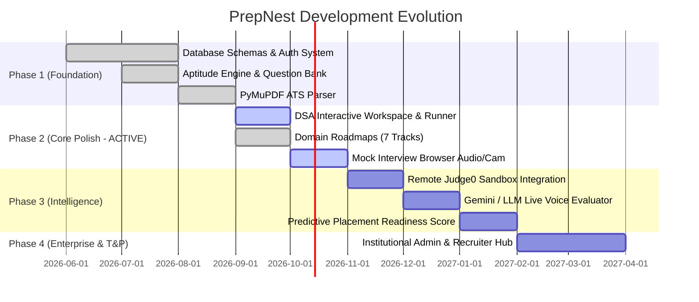

<!-- 
  PREPNEST CONTEXT SYSTEM | DOCUMENT 4 OF 5
  HOW TO UPDATE:
  - Update this document at the start of each sprint or upon completion of major milestones.
  - Move completed items to the 'Completed' section and update the 'Current Active Sprint'.
-->

# 🗺️ PrepNest — Product Roadmap & Execution Plan

| Parameter | Current Status |
| :--- | :--- |
| **Current Development Stage** | **Phase 2 (Core Enhancements & User Experience Polish)** |
| **Active Sprint Goal** | Stabilizing Interactive Code Solving, ATS Scoring Verifications, and Session Persistence |
| **Target Release Window** | Q4 2026 Academic Placement Cycle |

---

## 1. Phased Implementation Roadmap

---

## 2. Milestone Tracking

### ✅ Phase 1: Foundational Infrastructure (Completed)
- [x] **PostgreSQL / Neon Architecture:** Designed normalized schema with `users`, `aptitude_questions`, `resume_analyses`, `dsa_problems`.
- [x] **Dual Authentication Framework:** Integrated Neon Managed Auth with local JWT bearer token fallbacks.
- [x] **Aptitude Testing Engine:** Built full test runner supporting timer limits, category filters, question flags, and instant scorecards.
- [x] **Resume ATS Parser:** Engineered multi-format extraction (`.pdf` and `.docx`) with skill taxonomy extraction and section scoring.
- [x] **Curated Domain Roadmaps:** Seeded 7 primary engineering tracks (Frontend, Backend, Fullstack, DSA, AI/ML, DevOps, Core CS) with 35 topics and capstone mini-projects.

---

### 🟡 Phase 2: User Experience Polish & Core Enhancements (Active Sprint)
- [x] **DSA Problem Directory & Filters:** Category, difficulty, and company tags (Google, Amazon, Meta, etc.).
- [x] **LeetCode-Style Solving Modal (`DSAPracticeModal.jsx`):** Integrated code runner with sample and hidden test case validation.
- [x] **Resume Target Matcher & Bullet Point Enhancer:** Re-scores resume against specific company job descriptions and delivers AI bullet improvements.
- [ ] **Live Mock Interview Audio/Video Feedback:** Connect browser MediaRecorder stream to backend speech-to-text transcript analysis.
- [ ] **Automated Performance Analytics Dashboard:** Consolidate student progress across DSA, Aptitude, and Roadmaps into a single composite radar chart.
- [ ] **Settings & Profile Synchronization:** Enable full update of GitHub/LeetCode handles, academic marks (CGPA, 10th/12th), and daily practice target goals.

---

### 🔮 Phase 3: Advanced Intelligence & Scaling (Upcoming)
- [ ] **Distributed Sandbox Code Execution (Judge0 API):** Transition from local script execution to sandboxed multi-language compilation (C++, Java, Python, JavaScript, Go).
- [ ] **Conversational Placement Mentor (Gemini API):** Implement real-time streaming LLM assistance in `AIAssistant.jsx` with syntax-highlighted code completions.
- [ ] **Company Question Prediction Engine:** Machine learning heuristic analyzing past 3 years of campus placement tests to predict trending topics per recruiting firm.
- [ ] **Peer Discussion & Solution Editorial Submissions:** Enable students to publish DSA solutions, comment on tricky aptitude problems, and upvote explanations.

---

### 🏢 Phase 4: Institutional T&P Cell & Recruiter Ecosystem (Long-Term)
- [ ] **Institutional Admin Analytics:** Allow university placement cells to view aggregate cohort stats, track low-readiness students, and export CSV reports.
- [ ] **Campus Contest Host Engine:** Scheduled campus coding contests with real-time anti-cheat browser focus tracking and automated leaderboards.
- [ ] **Direct Recruiter Candidate Search:** Enable verified tech recruiters to search students by verified skill badges, ATS resume score, and contest rank.

---

## 3. Prioritized Feature Backlog

| ID | Priority | Feature Description | Complexity | Target Module |
| :--- | :--- | :--- | :--- | :--- |
| **B-01** | `P0` | Finalize profile update sync in `Settings.jsx` and persist academic metrics | Low | Profile / Backend |
| **B-02** | `P0` | Wire `AIAssistant.jsx` input to live Gemini / Backend LLM endpoint | Medium | AI Assistant |
| **B-03** | `P1` | Replace local DSA execution with Judge0 containerized API | Medium | DSA Problem Engine |
| **B-04** | `P1` | Real-time speech transcription & keyword evaluation in `MockInterview.jsx` | High | Mock Interview |
| **B-05** | `P2` | Social peer discussions and comments on Aptitude questions | Medium | Community |
| **B-06** | `P2` | Company-wise mock test simulation with negative marking timer | Low | Aptitude Engine |
| **B-07** | `P3` | Institutional T&P Admin dashboard and student batch export | High | Admin Portal |
